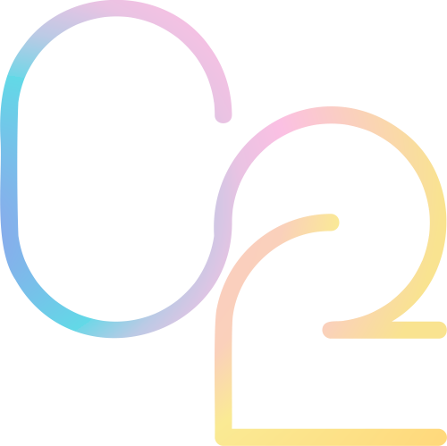

# The OmniOpen Initiative
[](http://creativecommons.org/publicdomain/zero/1.0/)
[](https://concurrent.studio/omniopen#platinum)

The Open Source Software Movement is both necessary and good.
It has increased the democratization of knowledge, created vast economic growth, and catalyzed the development of myriad new technologies.
Despite its tremendous good, the principles behind open source have long been limited to software, leaving other media closed or restricted.
This is not to say that these licenses don't exist, but while Creative Commons and others have met part of the need, widespread open-sourcing of non-stricly-code projects has yet to take off.
The OmniOpen Initiative is an attempt to raise the bar of true openness, valid across all media.
Where honesty and openness go, goodness follows.

## 📖 Contents
- [Certification Tiers](#-certification-tiers)
  + [OmniOpen Platinum](#omniopen-platinum)
  + [OmniOpen Gold](#omniopen-gold)
  + [OmniOpen Silver](#omniopen-silver)
  + [OmniOpen Bronze](#omniopen-bronze)
- [Certified Projects](#-certified-projects)
- [Descriptions and Justifications](#-descriptions-and-justifications)
  + [Public Domain License](#public-domain-license)
  + [Copyleft Open Source License](#copyleft-open-source-license)
  + [Open Source License](#open-source-license)
  + [Code of Conduct](#code-of-conduct)
  + [Contribution Guidelines](#contribution-guidelines)
  + [Statement of Purpose](#statement-of-purpose)
  + [Source Attribution and Notification](#source-attribution-and-notification)

## 🪜 Certification Tiers
OmniOpen certification is self-assessed. To be listed in under the [certified projects](#-certified-projects) section below, please submit an issue under the label `certification`.

### OmniOpen Platinum 
#### Requirements
- [Public Domain License](#public-domain-license)
- [Code of Conduct](#code-of-conduct)
- [Contribution Guidelines](#contribution-guidelines)
- [Statement of Purpose](#statement-of-purpose)
- [Source Attribution and Notification](#source-attribution-and-notification)

#### Badge
[](https://concurrent.studio/omniopen#platinum)
```
[](https://concurrent.studio/omniopen#platinum)
```
---

### OmniOpen Gold
#### Requirements
- [Copyleft Open Source License](#copyleft-open-source-license)
- [Code of Conduct](#code-of-conduct)
- [Contribution Guidelines](#contribution-guidelines)
- [Statement of Purpose](#statement-of-purpose)
- [Source Attribution and Notification](#source-attribution-and-notification)

#### Badge 
[](https://concurrent.studio/omniopen#gold)
```
[](https://concurrent.studio/omniopen#gold)
```
---

### OmniOpen Silver
#### Requirements
- [Copyleft Open Source License](#copyleft-open-source-license)
- [Code of Conduct](#code-of-conduct)
- [Contribution Guidelines](#contribution-guidelines)
- [Statement of Purpose](#statement-of-purpose)

#### Badge
[](https://concurrent.studio/omniopen#silver)
```
[](https://concurrent.studio/omniopen#silver)
```
---

### OmniOpen Bronze 
#### Requirements
- [Open Source License](#open-source-license)
- [Code of Conduct](#code-of-conduct)
- [Contribution Guidelines](#contribution-guidelines)
- [Statement of Purpose](#statement-of-purpose)

#### Badge 
[](https://concurrent.studio/omniopen#bronze)
```
[](https://concurrent.studio/omniopen#bronze)
```

## ✅ Certified Projects
[Projects will be added as necessary upon pull requests]

## 🔎 Descriptions and Justifications
### Public Domain License
A public domain license is required for platinum certification.
Defined best by [Creative Commons](https://wiki.creativecommons.org/wiki/public_domain): 

> When a work is in the public domain, it is free for use by anyone for any purpose without restriction under copyright law.
> Public domain is the purest form of open/free, since no one owns or controls the material in any way.

While many public domain licenses exist, we recommend Creative Commons' [CC0 1.0 Universal](https://creativecommons.org/publicdomain/zero/1.0/) license because of its thoroughness.
Alternatives like [WTFPL](http://www.wtfpl.net/) and the [Unlicense](https://unlicense.org/) are common.
Others can be found [here](https://tldrlegal.com/licenses/tags/Public%20Domain).
*Please note that this list is non-exhaustive, and other, non-listed licenses, are equally valid for achieving platinum certification.*

### Copyleft Open Source License
Copyleft licenses, required for gold or silver certification, are more restrictive than their public domain counterparts, but still freer than standard open source licenses.
Described by [GNU](https://www.gnu.org/licenses/copyleft.en.html), creators of the [General Public License](https://www.gnu.org/licenses/gpl-3.0.en.html):

> Copyleft is a general method for making a program (or other work) free (in the sense of freedom, not “zero price”), and requiring all modified and extended versions of the program to be free as well.

As GNU's [GPLv3](https://www.gnu.org/licenses/gpl-3.0.en.html) is so widely used, it is the copyleft license we recommend. 
Alternatives can be found [here](https://tldrlegal.com/licenses/tags/Copyleft), but like above, this list is non-exhaustive and other copyleft licenses are equally valid for gold or silver certification.

### Open Source License
Open source licenses, required for bronze certification, generally allow for free use, sharing and modification of a project's source material.

To paraphrase the [Free Software Foundation](https://www.gnu.org/philosophy/free-sw.en.html), for a project to be open source, anybody shall have:
> - The freedom to operate the work as they wish, for any purpose (freedom 0).
> - The freedom to study how the word is constructed, and change it as they wish (freedom 1). Access to the source material is a precondition for this.
> - The freedom to redistribute copies so they can help your neighbor (freedom 2).
> - The freedom to distribute copies of their modified versions to others (freedom 3). By doing this they can give the whole community a chance to benefit from their changes. Access to the source material is a precondition for this.

While there are seemingly infinite open source licenses, we recommend the [MIT License](https://opensource.org/licenses/MIT).
Alternatives can be found [here](https://opensource.org/licenses/alphabetical), but like above, this list is non-exhaustive and other open source licenses are equally valid for bronze certification.

### Code of Conduct
All OmniOpen certified projects, regardless of tier, must include a code of conduct, dictating guidelines that any contributors or independent modifiers are implored to follow.
As [GitHub's documentation](https://docs.github.com/en/free-pro-team@latest/github/building-a-strong-community/adding-a-code-of-conduct-to-your-project) states:

> A code of conduct defines standards for how to engage in a community. It signals an inclusive environment that respects all contributions. It also outlines procedures for addressing problems between members of your project's community. For more information on why a code of conduct defines standards and expectations for how to engage in a community, see the [Open Source Guide](https://opensource.guide/code-of-conduct/).

Twitter's [Code of Conduct](https://github.com/twitter/code-of-conduct/blob/master/code-of-conduct.md) is a great example to pull from.

### Contribution Guidelines
All OmniOpen certified projects, regardless of tier, must include a contribution guide, instructing in reasonable detail, how one can contribute to the project. 
While contribution guidelines are project specific, [Atom's Contribution Guide](https://github.com/atom/atom/blob/master/CONTRIBUTING.md) is a great example.

### Statement of Purpose
All OmniOpen certified projects, regardless of tier, must include a statement of purpose, both instructing users of the project's goal(s) and affirming its necessity.

### Source Attribution and Notification
A document listing a project's sources is required for platinum certification.
While these sources may be in any format, the format should be kept consistent.
It is suggested that you notify all sources of use in your project, preferably in the form of a brief "thank you," as their work helped in the creation of yours.
